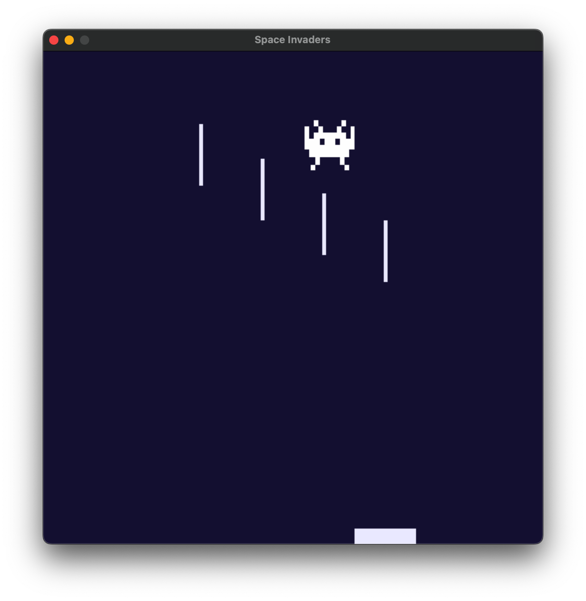
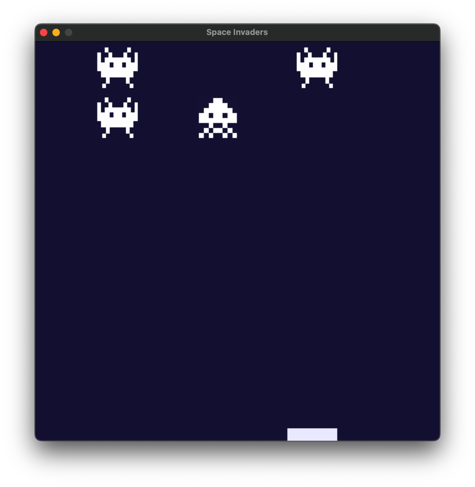

# Alien
Simple game on Python, shoot 'em aliens and get back your murder score

```bash
# Clone repository
git clone https://github.com/deeptimahesh/Alien.git

# Activate your virtual env
# source "virutal-env/bin/activate"

python3 -m pip install -U pygame --user
python alien.py
```



